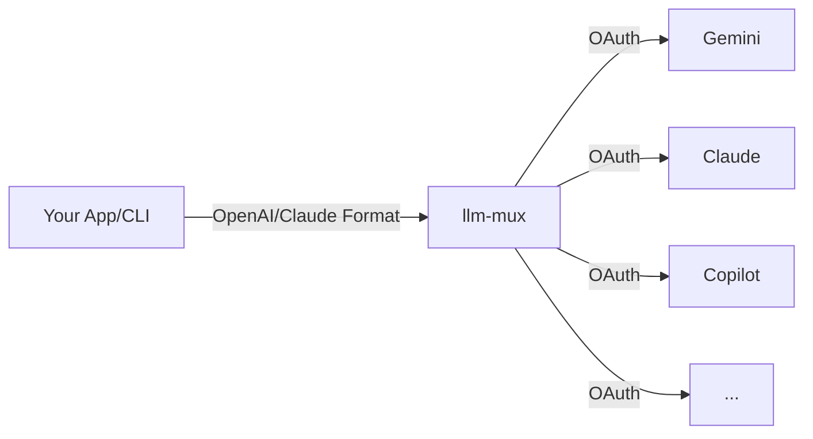

# llm-mux

[](https://opensource.org/licenses/MIT)
[](https://github.com/nghyane/llm-mux)
[](https://golang.org)

**The Universal AI Gateway.** Access Gemini, Claude, OpenAI, and GitHub Copilot models through a single local API. No API keys required—just OAuth.



## ⚡️ Quick Install

Get up and running in seconds. The installer sets up the binary and a background service automatically.

| OS | Command |
|:---|:---|
| **macOS / Linux** | `curl -fsSL https://raw.githubusercontent.com/nghyane/llm-mux/main/install.sh \| bash` |
| **Windows** (PowerShell) | `irm https://raw.githubusercontent.com/nghyane/llm-mux/main/install.ps1 \| iex` |
| **Docker** | `docker run -p 8318:8318 -v ~/.config/llm-mux:/root/.config/llm-mux nghyane/llm-mux` |

---

## 🔐 Authentication

Authenticate once, use forever. Tokens are auto-refreshed.

```bash
# Most Popular
llm-mux --login          # Google (Gemini Pro/Flash)
llm-mux --claude-login   # Anthropic (Claude 3.5 Sonnet/Opus)
llm-mux --copilot-login  # GitHub (GPT-4o, GPT-4.1)

# Others
llm-mux --codex-login    # OpenAI Codex
llm-mux --qwen-login     # Qwen / Alibaba
```

---

## 🚀 Usage

`llm-mux` runs on `http://localhost:8318`. Point **any** AI client (Cursor, VS Code, Python, LangChain) to this URL.

### Example: Using OpenAI Format (Universal)
You can call *any* model using the standard OpenAI format:

```bash
curl http://localhost:8318/v1/chat/completions \
  -H "Content-Type: application/json" \
  -d '{
    "model": "gemini-2.5-flash",
    "messages": [{"role": "user", "content": "Explain quantum computing in one sentence."}]
  }'
```

### Supported API Endpoints
| Standard | Endpoint URL | Use Case |
|:---|:---|:---|
| **OpenAI** | `/v1/chat/completions` | Most apps, LangChain, AutoGen |
| **Anthropic** | `/v1/messages` | Cursor, Claude Dev, Aider |
| **Gemini** | `/v1beta/models/...` | Google ecosystem tools |
| **Ollama** | `/api/chat` | Local-first tools |

> **Tip:** List all available models with `curl http://localhost:8318/v1/models`

---

## 🛠️ Advanced & Services

<details>
<summary><strong>🖥️ Service Management (Start/Stop)</strong></summary>

| Action | macOS (`launchctl`) | Linux (`systemd`) | Windows (`Task Scheduler`) |
|:---|:---|:---|:---|
| **Start** | `launchctl start com.llm-mux` | `systemctl --user start llm-mux` | `Start-ScheduledTask "Start llm-mux"` |
| **Stop** | `launchctl stop com.llm-mux` | `systemctl --user stop llm-mux` | `Stop-ScheduledTask "Start llm-mux"` |
| **Logs** | `~/.local/var/log/llm-mux.log` | `journalctl --user -u llm-mux` | Windows Event Viewer |

</details>

<details>
<summary><strong>☁️ Sync Config with GitStore (Pro)</strong></summary>

Sync your tokens and config across multiple machines using a private Git repo.

1. Create a private empty repo on GitHub.
2. Set environment variables (in `.bashrc` or Windows Env):
   ```bash
   export GITSTORE_GIT_URL=https://github.com/username/my-mux-store.git
   export GITSTORE_GIT_USERNAME=your_user
   export GITSTORE_GIT_TOKEN=your_pat_token
   ```
3. Restart `llm-mux`. It will auto-sync!
</details>

<details>
<summary><strong>🏗️ Architecture</strong></summary>

*   **Intermediate Representation (IR)**: Translates requests 2N times instead of N² times.
*   **Provider Adapters**: Handles specific OAuth flows and token rotation.
*   **Load Balancer**: Smart routing based on quota availability.
</details>

## License

MIT License - see [LICENSE](LICENSE)
